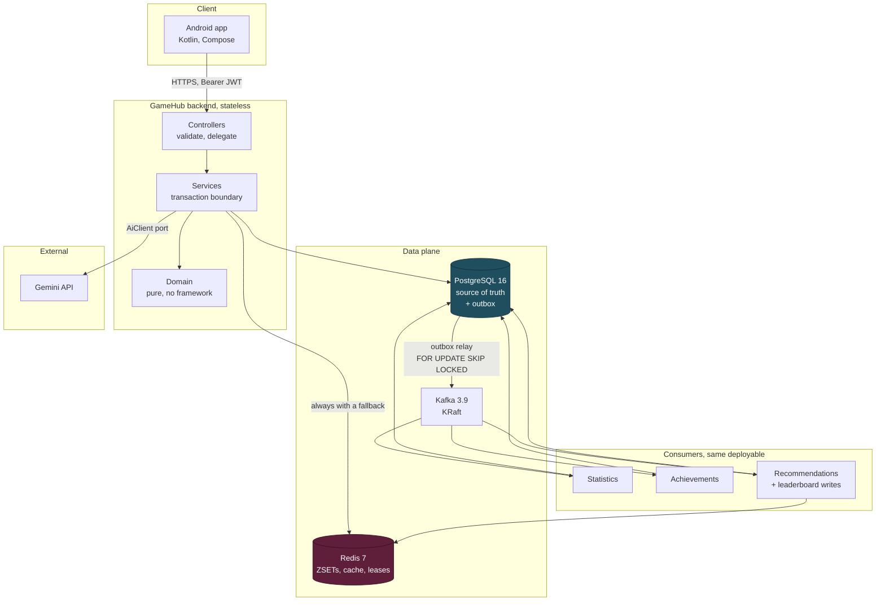
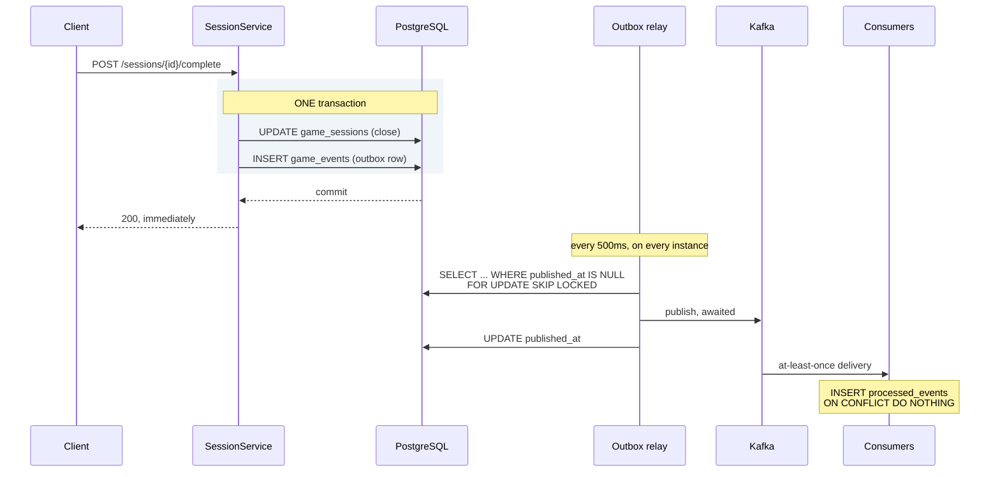
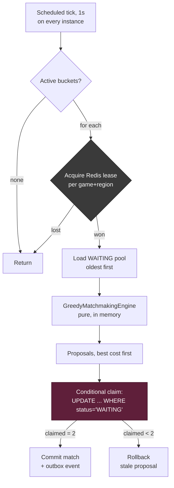
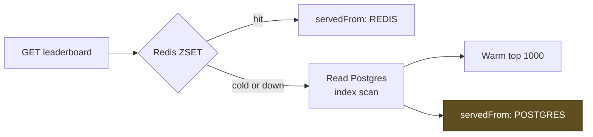
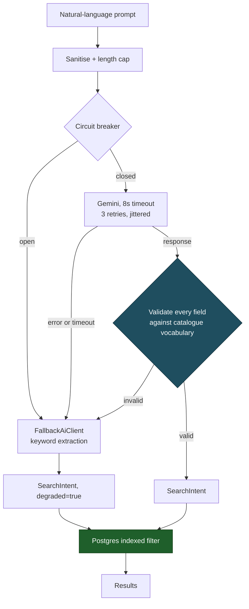
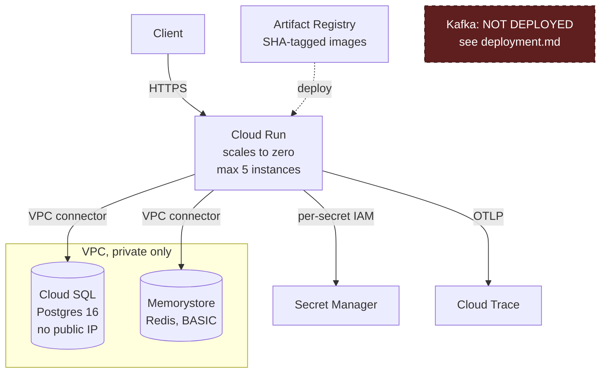
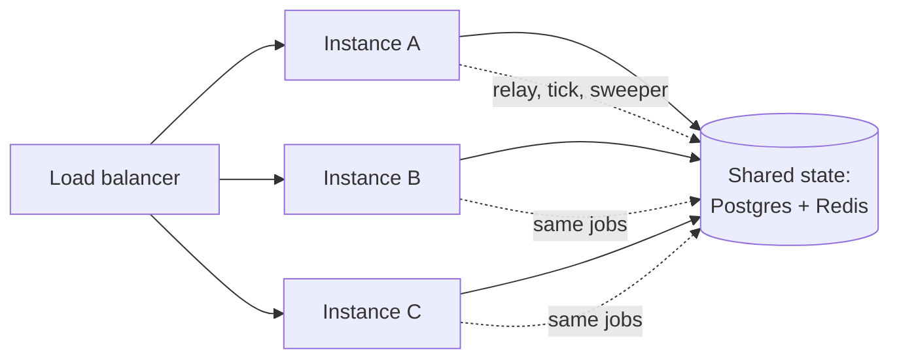

# Architecture diagrams

Mermaid, so they render on GitHub and stay diffable in review. An image would
be neither.

## System overview

The colour split is the important part: **Postgres is the only hard
dependency.** Losing Redis costs latency; losing Kafka stops derived state
updating but loses nothing, because events are already durable in the outbox.

## The dual-write problem, and the outbox

If the process dies between publish and stamp, the row is republished. That
duplicate is expected, and the ledger absorbs it.

## Matchmaking tick

The **highlighted claim** is the safety mechanism. The lease is grey because
it is only an optimisation: if it fails open, three instances propose
overlapping pairings, the claim rejects the duplicates, and the outcome stays
correct.

## Leaderboard read, with fallback

`servedFrom` is in the response deliberately, so a silent degradation becomes
a countable one.

## AI request path

Two things this diagram is meant to make obvious:

1. **Every path reaches a result.** There is no branch that returns an error.
2. **The model never touches the database.** It produces filter parameters;
   Postgres does the searching. A prompt injection can make the filters odd —
   it cannot exfiltrate data or bypass authorisation.

## Deployment, cloud

Kafka is drawn as absent on purpose. Managed Kafka on GCP has no
scale-to-zero tier and would cost more than everything else combined. The
outbox means the transport is swappable, and `deployment.md` sets out the
three options. A diagram showing Kafka that is not actually deployed would be
a lie.

## Instance scaling

All three run the same background jobs. Safety comes from `SKIP LOCKED`,
conditional claims and idempotent updates — not from electing one of them.

**The real ceiling is database connections, not CPU:** 20 per instance against
`max_connections = 200`. Beyond ~5–8 instances the answer is PgBouncer, not
more instances.
